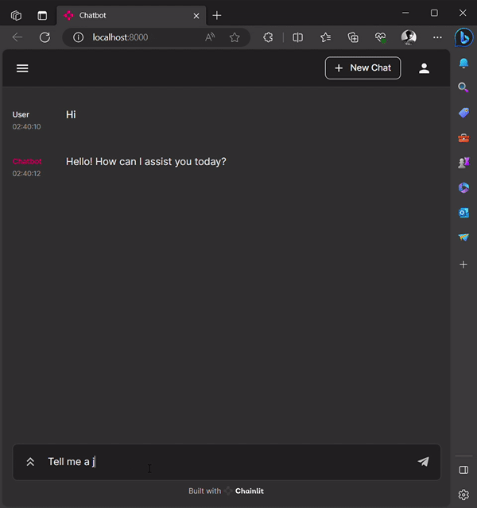

# **The Jester**

**[The Jester](.)** is a project that I developed for a job inteview assessment. It uses _[OpenAI's gpt-3.5-turbo](https://openai.com/chatgpt)_ large language model, to **generate jokes**. The model is trained on a massive dataset of text and code, and it can be prompted to generate jokes of different genres, lengths, and levels of sophistication.

**[The Jester](.)** uses prompt engineering to generate. **Prompt engineering** is a technique that involves using instructions to guide the language model in generating the desired output. For example, **[The Jester](.)** might be prompted to generate a joke that is funny, original, and relevant to a particular topic.

In addition to generating jokes, **[The Jester](.)** can also **rate and review jokes**. This too is acheived via prompt engineering.


### Alternative Approaches
1.  **sentiment analysis** - Could be used to **rate and review** jokes.
2. A generative model could have been **fine-tuned** for the same purpose where it would predict tokens in masks, preferably by using transformers library from huggingface.

> **Note:** These were not opted for due to the time constraints and rapid development requirements.


# Configurations
Set the following enironment variables.
```bash
export OPENAI_API_KEY=<YOUR_API_KEY>
export OPENAI_MODEL=<YOUR_MODEL>
# Optionally you can setup github secret for these.
```
Create a virtual environment and activate it.
```bash
python -m venv .venv
source .venv/bin/activate
```
Install the Python packages.
```bash
pip install openai chainlit
# OR
pip install -r ./requirments.txt
```


# Run the project
You can use the GUI - Graphical User Interface, made using [ChainLit ]((https://docs.chainlit.io/overview)).
```bash
# Run this on a terminal after activating the python virtual enviroment
chainlit run gui.py -w
```
This will show you a http://localhost:8000 link which you can click to open into the browser and chat.

To run the test cases:
```python
py.test
```


# Demo
